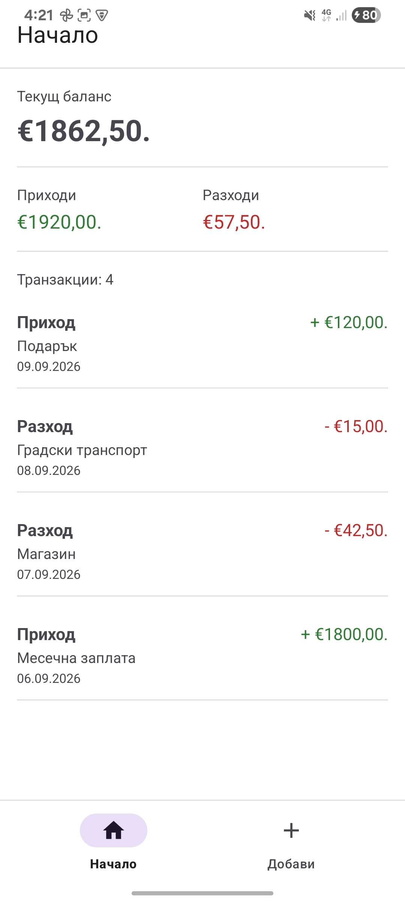
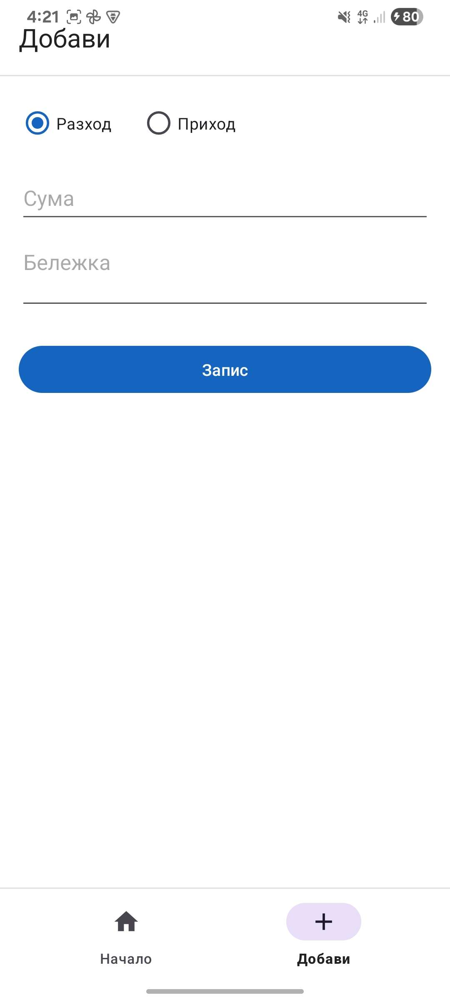

# Финансов мениджър

## Идея

Целта е потребителят да има ясна картина на своите приходи, баланси и цялостен баланс.
Темата е домашен финансов мениджър с табло (баланс и списък) и форма за нова транзакция. Няма екран за вход.

## Как работи

Потребителят не трябва да се регистрира, за да използва приложението. При първо стартиране Room създава база от данни и я зарежда с примерни транзакции.

Приложението съдържа два основни екрана:

- "Начало" показва баланс, приходи, разходи и пълния списък с транзакции.
- "Добави" записва нова транзакция в базата.

## Архитектура

Използва се MVVM с ръчен контейнер за зависимости.

- View: XML layout-и с View Binding. Activity/Fragment наблюдават LiveData и не пишат в базата директно.
- ViewModel: пази UI състояние и вика Repository. `ViewModelFactory` подава Repository.
- Model: Room entity класове за таблиците, DAO класове за заявки, domain модели за екраните.

Навигация:

- стартов екран е `MainActivity`
- фрагментите в `MainActivity` се сменят с Navigation Component и BottomNavigationView

## Потребителски поток

1. Потребителят отваря приложението и вижда таблото с баланс, приходи и разходи.
2. От долното меню превключва към Добави.
3. В Добави избира тип (разход или приход), сума и по желание бележка, след което записва.
4. Новият запис се появява в списъка и променя баланса на таблото.

## Стъпки за стартиране

Нужни са Android Studio Ladybug или по-нова, JDK 17 и Android SDK с `compileSdk 35`.

1. Клонирайте хранилището и отворете папката в Android Studio.
2. Изчакайте Gradle Sync.
3. Свържете устройство с USB debugging или стартирайте емулатор.
4. Run app върху модул `app`.

## Тестови акаунти

Няма вход и няма потребителски акаунти. Приложението се отваря направо.

При първо стартиране базата идва с примерни транзакции (заплата, магазин, транспорт и подарък), за да може таблото да се прегледа без ръчно въвеждане.

## Скрийншотове

## APK

Готова debug APK се намира в:

`docs/apk/FinanceManager-debug.apk`